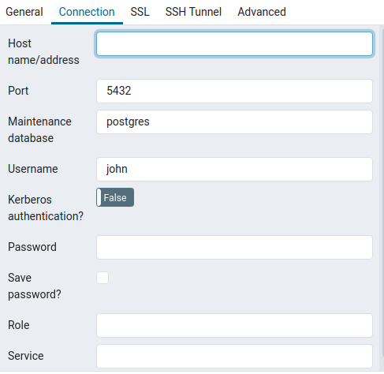

# Prerequisites

Creating simple app with frontend implemented in React and connected with a simple API written in Node.js with data saved in PostgreSQL DB.

The application should allow a user to add an event to the database, with the
following fields:
1. First name (required)
2. Last name (required)
3. Email (required, valid email address)
4. Event date (required, simple date picker)

# Tech Stack

1. [Postgres](https://www.postgresql.org/) - Database
2. [ExpressJS](https://expressjs.com/) - Web Framework
3. [ReactJS](https://reactjs.org/) - Frontend Framework

# Development

1. Start database

```sh
$ docker-compose -f docker-compose.yml up -d
# check localhost:8000 to watch db in pgAdmin
```
2. Install server dependencies
   ```sh
   # remember to setup .env(check .env.example)
   $ cd server && yarn install
```

3. Run migrations and seeds
   To create tables you need to run:
   ```sh
   npx knex migrate:latest
   ```
   Additionally you can fill your tables with example data:
   ```sh
   npx knex seed:run
   ```

4. Run server

```sh
# remember to setup .env(check .env.example)
$ yarn start:dev
# check localhost:3001
```

5. Install and run client

```sh
# remember to setup .env(check .env.example)
# Starting from root of project
$ cd client && yarn install && yarn start
# check localhost:3000(should run browser automatically)
```

# Troubleshoot

## Run PgAdmin
1. Login to the pgAdmin panel with variables **PGADMIN_DEFAULT_EMAIL** and **PGADMIN_DEFAULT_PASSWORD** from docker-compose.yml

2. Add new server from pgAdmin panel.
   * Click "Add new server"


   * Fill in server config
        
     * In **General Tab** - add any name 
        
     * In **Connection Tab** 
        
       * add *Host name/address*
        
        To find Host name of postgreSQL DB use:
               
       ```sh
           docker inspect -f '{{range.NetworkSettings.Networks}}{{.IPAddress}}{{end}}'
        ``` 

         * set *port* to 5432
         * fill other data from docker-compose.yml:
              - POSTGRES_DB as *Maintenance database*
              - POSTGRES_USER as *Username*
              - POSTGRES_PASSWORD as *Password*

    ## Run Psql
    To run db in terminal by psql:
    1. Run shell in your container
    ```sh
        docker exec -it ***container_id*** /bin/bash
    ```
    2. Run psql command to get into db
    ```sh
        psql -U admin -d dev
    ```
# Author

[Wojciech](https://github.com/wszczepanski97)

# TODO
- **add tests!!!** 
- update README
